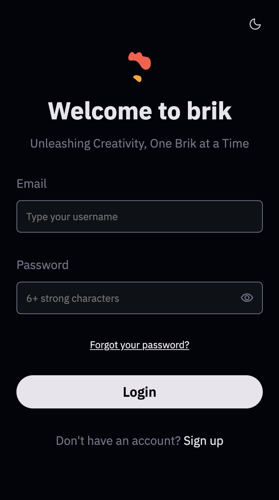
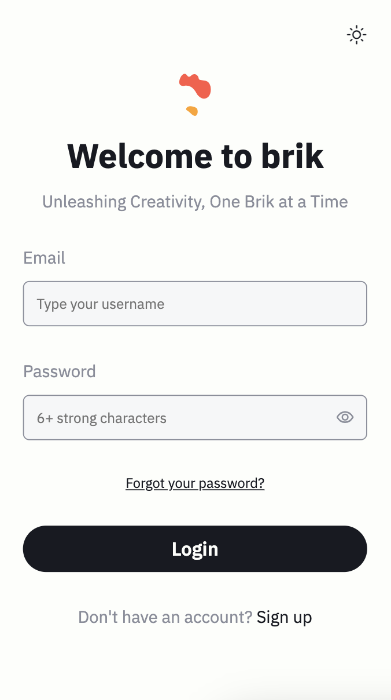

# Brik

## Build web like bricks

## Overview

Brik is a lightweight JS library that provides a minimalistic way of create components. It is designed to be fast, efficient, and easy to use, with a total weight of just 10% compared to Bootstrap. Brik focuses on providing essential styling and utility classes while keeping the codebase small and efficient.




## Getting Started

To use Brik in your web project, follow these simple steps:

### Step 1: Include Brik Stylesheet

Add the following code to the end of the `<body>` section of your HTML file to include the Brik CDN:

```html
<script src="https://cdn.jsdelivr.net/gh/dfralan/brik@main/brik.js"></script>
```

### Step 2: Create Brik Elements

Brik provides a set of utility classes that you can apply to HTML elements to achieve the desired styling. Here's an example of how to create a button using Brik classes:

```html
<button class="btn btn-primary">Primary Button</button>
<button class="btn btn-secondary">Secondary Button</button>
```

You can also create HTML components directly on a js file and add Javascript functionalities

```html
<!-- Register section -->
<brik register></brik>
<script src="src/js/components/registerView.js"></script>
```

```javascript
var register =
`
<section id="registerSection" class="display-none">
    <div style='padding-top: 50%' class="full-center flex-col m-gap height-100">
    <button id="showWelcomeSectionButton2" class="btn color-primary underlined">Go back</button>
        <h3>
            <span class="color-primary">We allow only already registered users</span>
            <span class="color-tint">:(</span>
        </h3>
    </div>
</section>
`
```


You can explore the full list of utility classes available in the Brik JS stylesheet to style various elements on your webpage.

### Step 3: Customize Your Theme (Optional)

Brik comes with a light and dark theme by default. You can easily customize the theme colors by modifying the `brikStyleSheet` at the beginning of the stylesheet to match your project's branding.

## Themes

Brik supports light and dark themes, and it can automatically switch between them based on the user's system preferences. You can also provide a theme switcher button on your website to allow users to toggle between light and dark themes.

## License

Brik is open-source software released under the [MIT License](https://opensource.org/licenses/MIT). You are free to use and modify it for your projects.

## Brik in action

You can see Brik in action here. You are free to use and modify it for your projects.
[landing-demo](https://dfralan.github.io/brik/index.html)
[menu-demo](https://dfralan.github.io/brik/demo.html)

## Acknowledgments

Brik is inspired by the principles of minimalism and efficiency. It aims to provide a lightweight alternative to larger CSS frameworks like Bootstrap while maintaining flexibility and ease of use. We thank the open-source community for their contributions to web development.

---

Enjoy using Brik for your web projects! If you have any questions or need further assistance, feel free to reach out to our support team.
